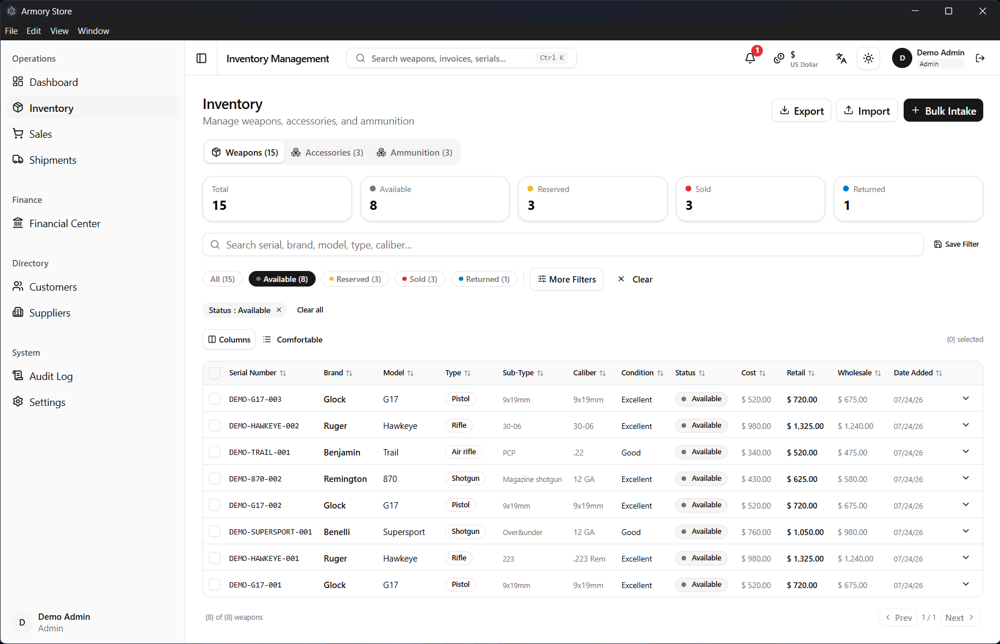
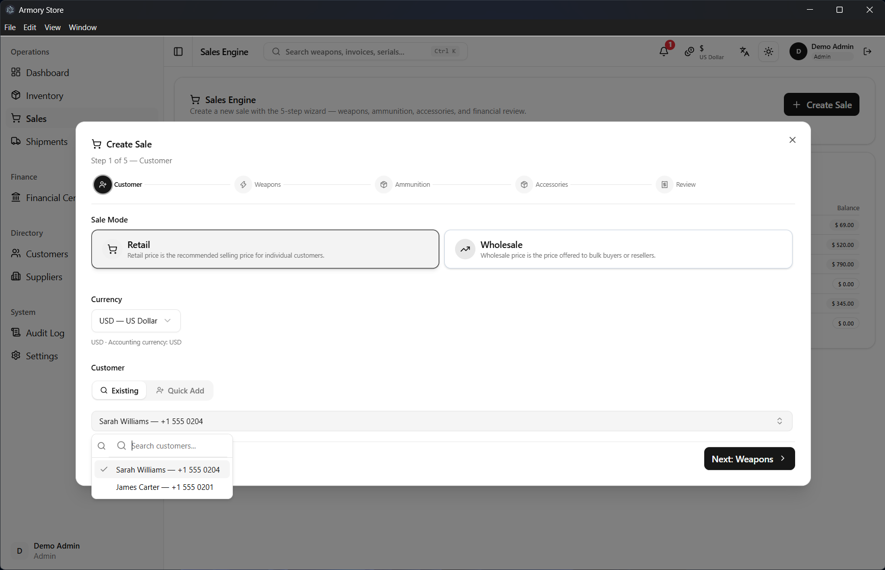
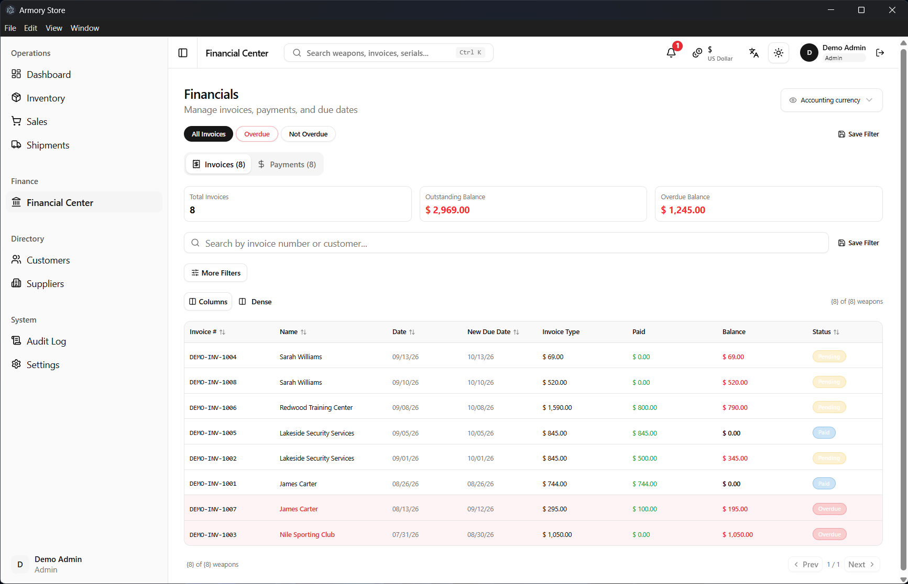
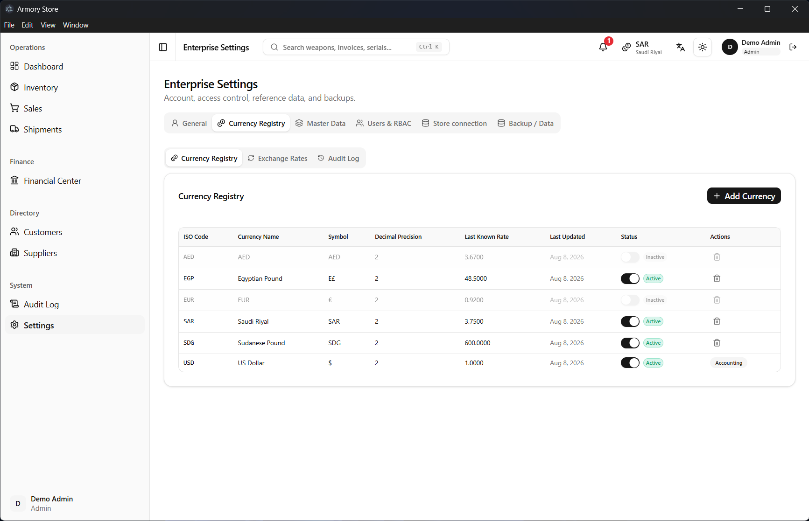
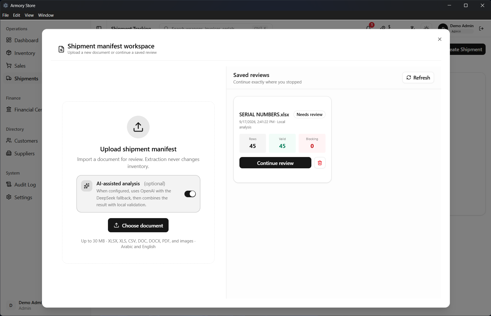

# StoreOps Desktop

[](https://github.com/pqun7/storeops-desktop/actions/workflows/ci.yml)
[](https://github.com/pqun7/storeops-desktop/releases/latest)
[](LICENSE)
[](package.json)

**A desktop store-operations platform for serialized inventory, originally built from a real retailer's operational requirements.**

StoreOps Desktop brings inventory, shipment intake, sales, receivables, multi-currency accounting, user permissions, and audit history into one bilingual Electron application. A store can work offline with SQLite or connect multiple devices through Supabase/PostgreSQL.

[Download for Windows](https://github.com/pqun7/storeops-desktop/releases/latest) · [Quick start](#quick-start) · [Documentation](#documentation)

## Product tour

### Inventory and sales

| Serialized inventory | Sales workflow |
| --- | --- |
|  |  |

### Finance and multi-currency operations

| Financial center | Multi-currency reporting |
| --- | --- |
|  |  |

### AI-assisted manifest intake



Shipment documents can be parsed locally when supported or analyzed with OpenAI and a configurable DeepSeek fallback. Files and extracted values are validated locally, and a person reviews the proposed rows before inventory is changed.

## What it covers

- Serialized inventory, product catalogues, suppliers, customers, shipments, and sales.
- Receivables, payment tracking, product cost, and transaction-time currency data.
- English and Arabic interfaces with role-based access control and audit history.
- Offline SQLite storage or shared Supabase/PostgreSQL storage.
- Safe provider migration with source preservation, destination backup, and verification.
- AI-assisted document intake with schema-constrained output and human approval.

## Architecture

```text
React + TypeScript renderer
          │ typed, restricted IPC
          ▼
Electron main process ── validation, authorization, audit, document parsing
          │
          ├── SQLite (single-computer, offline)
          └── Supabase/PostgreSQL (shared, multi-device, RLS protected)
```

Only one database provider is active at a time. SQLite access and privileged operations remain in Electron's main process. Supabase uses row-level security and server-side functions as the authorization boundary; secret/service-role credentials are never bundled into public builds.

## Engineering highlights

- Immutable, checksummed migrations and SQLite integrity checks.
- Validated inventory writes with serial uniqueness and permission enforcement.
- Transaction-safe backups, restore workflows, and provider migration.
- Defensive document handling: extension, size, signature, archive, and type validation.
- CI quality gate for type checking, zero-warning linting, coverage, Python tests, SQLite integration, dependency audit, and production build.
- Generic Windows packages contain no store-specific Supabase configuration.

## Tech stack

| Layer | Technology |
| --- | --- |
| Desktop/UI | Electron, React 19, TypeScript, Tailwind CSS, Radix UI |
| Local data | SQLite |
| Shared data | Supabase, PostgreSQL, Row Level Security |
| State and validation | Zustand, Zod |
| Documents and AI | XLSX/DOCX/PDF parsing, OpenAI, optional DeepSeek fallback |
| Quality | Vitest, Testing Library, ESLint, GitHub Actions |

## Quick start

Requires Node.js 24+ and Python 3.12+.

```bash
git clone https://github.com/pqun7/storeops-desktop.git
cd storeops-desktop
npm ci
npm run dev
```

On first launch, choose local SQLite for a single computer or Supabase for a shared store. No cloud account is required for local mode.

Useful checks:

```bash
npm test
npm run build
npm run electron:build:win
```

## Windows release

Download `StoreOps-Desktop-Setup-<version>-x64.exe` from the [latest GitHub release](https://github.com/pqun7/storeops-desktop/releases/latest). Release tags must match `package.json`; the workflow publishes the installer, update metadata, and SHA-256 checksums after the quality gate succeeds.

Version 1.2.0 changes the visible product identity while deliberately preserving legacy identifiers required by existing installations, including the application ID, package name, user-data directory, SQLite filename, storage keys, Supabase Vault names, and historical migrations.

## Documentation

- [AI manifest extraction](MANIFEST_EXTRACTION.md)
- [Supabase operations](docs/SUPABASE_OPERATIONS.md)
- [RBAC and user management](docs/RBAC_USER_MANAGEMENT.md)
- [Password recovery](docs/PASSWORD_RECOVERY.md)
- [Test suites](tests/README.md)
- [Security policy](SECURITY.md)
- [Contributing guide](CONTRIBUTING.md)

## Responsible use

StoreOps Desktop manages operational records; it does not replace licensing, background checks, transfer procedures, tax rules, export controls, or other legal obligations. Operators remain responsible for lawful configuration and use. Do not send sensitive documents to an AI provider until its data-processing terms have been approved for your organization.

## License

Released under the [MIT License](LICENSE). The license covers the software only and grants no authorization to buy, sell, transfer, import, export, or possess regulated items.
